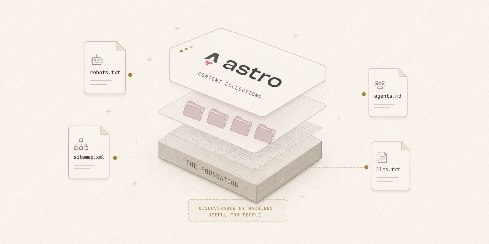

The site was rebuilt on Astro, with content living in typed content collections rather than hand-maintained pages. This is the substrate every later entry builds on — writing and builds are Zod-validated collections, and pages that expose them (the sitemap, `llms.txt`, this changelog) are generated from that same source at build time.

## The discoverability layer

The rebuild shipped the foundational files that make the site legible to machines as well as people:

- **`robots.txt`** — allow-all, including AI crawlers.
- **XML sitemap** — auto-generated, with per-page last-modified dates.
- **`agents.md`** — a plain-language brief for AI agents reading or citing the site.
- **`llms.txt` / `llms-full.txt`** — a concise index and a full content export.

Plus a simplified visual baseline, a favicon set, and Open Graph / Twitter share metadata.
