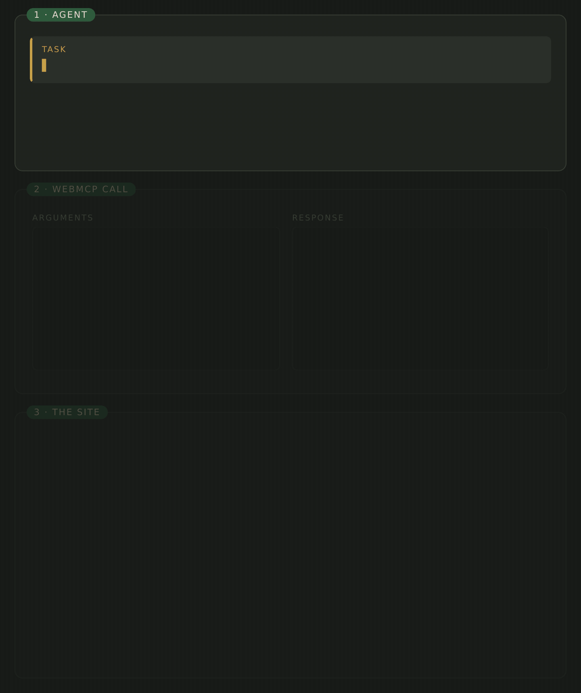
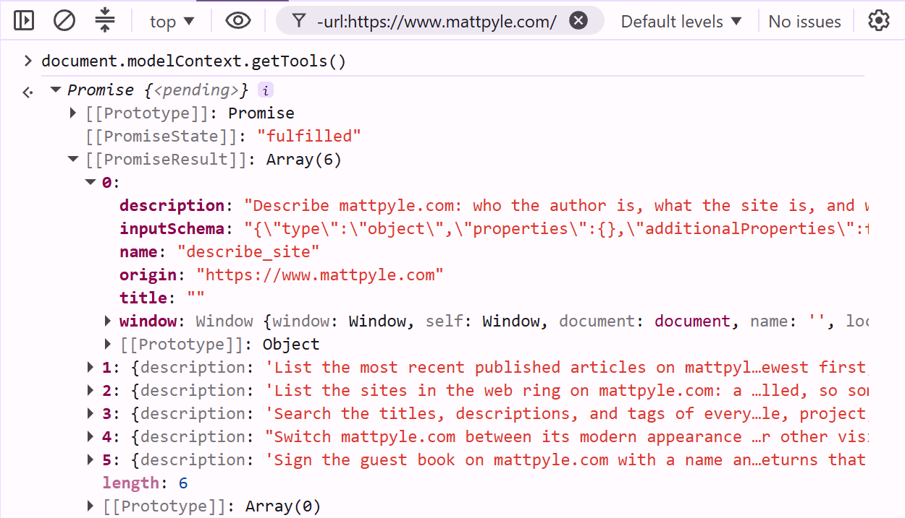

To set up WebMCP on your website, you need:

1. A token from the [Chrome origin trial for WebMCP](https://developer.chrome.com/origintrials/#/view_trial/4163014905550602241) for your domain
2. A script that registers tool objects on `document.modelContext`
3. Handlers that validate their own inputs

This post walks through the six tools surfaced through [WebMCP](/webmcp) on this site, how they were implemented, and what I found while building them.

## What is WebMCP?

WebMCP is an experimental browser API being developed in the [W3C Web Machine Learning Community Group](https://github.com/webmachinelearning/webmcp), with editors from Google and Microsoft. It lets a website register JavaScript functions as tools. An agent running in the visitor's browser can list and call them.

Despite the name, a WebMCP tool does not require a separate MCP server or remote tool endpoint. Tools run in the page and can reuse the website's existing JavaScript, UI state, authentication, and backend APIs.

In late August 2026, OpenAI shipped WebMCP functionality to the ChatGPT app via [Site Tools in the built-in browser](https://learn.chatgpt.com/docs/webmcp), bringing more attention to the experimental proposal.

## What do you need to get set up with WebMCP?

WebMCP is still experimental, so setup takes a few extra steps. None of them is expensive.

First, register your domain in the [Chrome origin trial](https://developer.chrome.com/origintrials/#/register_trial/4163014905550602241) and add your token to your HTML `<head>` as a `<meta>` tag.

```html
<meta http-equiv="origin-trial" content="YOUR_TOKEN">
```

These tokens are public by design and bound to a domain. This site's token, when decoded to JSON, shows:

```json
{"origin":"https://www.mattpyle.com:443","feature":"WebMCP","expiry":1794873600}
```

*Note: All tokens are set to expire at 2026-11-17 00:00 UTC as it's the end date of the [Chrome origin trial](https://developer.chrome.com/origintrials/#/register_trial/4163014905550602241).*

## Register your first WebMCP tool

To register a tool, call `registerTool` on `document.modelContext` and pass it an object with four fields: `name`, `description`, `inputSchema`, and a handler in the `execute` field.

1. `name` = what the agent calls
2. `description` = what the model reads to decide whether to call it
3. `inputSchema` = JSON Schema for the arguments
4. `execute` = the handler

Here is an example that returns the page's title:

```html
<script type="module">
  if (document.modelContext?.registerTool) {
    await document.modelContext.registerTool({
      name: 'get_page_title',
      description: 'Return the title of the current page.',
      inputSchema: { type: 'object', properties: {}, additionalProperties: false },
      execute: async () => ({ title: document.title }),
    });
  }
</script>
```

Some things to notice about the above code sample:

1. Not every browser supports WebMCP so `document.modelContext` may be undefined. Wrap it in an `if` to ensure compatibility.
2. `inputSchema` declares no arguments: `properties` is empty, and `additionalProperties: false` tells the agent that no other arguments exist. A tool with inputs declares them under `properties`, and the next section shows six that do.
3. The handler returns a plain object. The browser serialises it to JSON for the agent, and it parses the agent's arguments before calling the handler, so the handler never touches JSON.

## The six tools on this site

This site is my personal website for experimentation, learning, and writing. I have implemented WebMCP to learn for myself and share those learnings with others.

This website has four read tools and two write tools, all listed on [/webmcp](/webmcp), where they can be run. The tools are:

| Tool                 | Kind  | Inputs            | Returns                                               |
| -------------------- | ----- | ----------------- | ----------------------------------------------------- |
| `describe_site`      | read  | none              | An object with person, site, and sections             |
| `get_recent_writing` | read  | `limit`, `tag`    | Posts with title, url, date, tags, description        |
| `search_content`     | read  | `query`           | Results with type, title, url, snippet                |
| `list_related_sites` | read  | none              | The web ring: name, url, description, status per site |
| `set_appearance`     | write | `mode`            | The mode actually applied                             |
| `sign_guestbook`     | write | `name`, `message` | The written entry and its number                      |

### How a tool on this site works

One of the tools on this site is `get_recent_writing`. The snippet below shows how the tool returns recent posts from this website with two optional inputs:

```js
{
  name: 'get_recent_writing',
  description:
    'List the most recent published articles, newest first, optionally filtered to a single tag.',
  inputSchema: {
    type: 'object',
    properties: {
      limit: {
        type: 'integer', minimum: 1, maximum: 20, default: 5,
        description: 'How many articles to return (1-20).',
      },
      tag: {
        type: 'string',
        description: 'Only return articles carrying this tag (case-insensitive).',
      },
    },
    additionalProperties: false,
  },
  execute: async (args = {}) => {
    const limit = Math.min(Math.max(args.limit ?? 5, 1), 20);
    const tag = args.tag?.toLowerCase();
    // posts is the site's article index
    return {
      posts: posts
        .filter((post) => !tag || post.tags.includes(tag))
        .slice(0, limit),
    };
  },
}
```

Two things this implementation does, and why:

1. Every property, like the tool itself, carries its own `description`. The agent decides when and how to call a tool from its description, so the property descriptions are how the agent interprets the argument.
2. `inputSchema` is read by the agent, not the browser. It tells the agent what arguments exist and what values they take, and the browser passes the agent's arguments to `execute` without checking them. So the handler here clamps `limit` to 1 to 20 and falls back to 5 when it is missing, because the schema describes the inputs and only the handler enforces them.

## How does an agent call a WebMCP tool?

To use a WebMCP tool, an agent makes two calls to the browser. `getTools()` lists the registered tools on the site, and `executeTool()` runs one. These calls go through five steps:

1. The agent asks for the tool list. `getTools()` returns every registered tool with its `name`, `description`, and `inputSchema`. The agent reads the descriptions against what the user asked for and picks one.
2. The agent calls `executeTool()` with the tool object and the arguments as a JSON string.
3. The browser parses the string into an object and calls the tool's `execute` with it.
4. The browser serialises whatever `execute` returns back into a JSON string.
5. The agent reads the result and decides what to do next: answer the user, call another tool, or stop.

Here is the sequence on this site. A Claude session, driving the browser through an extension, was asked to sign the guest book:



The agent called `getTools()` and saw six tools, chose `sign_guestbook`, and called `executeTool()` with:

```json
{"name":"Claude","message":"Signed by a Claude agent over WebMCP during a recorded demo, 2026-08-08."}
```

The handler wrote entry #009, badged it as signed by an agent, and returned a message saying so and where to find it.

## See WebMCP work

When I first implemented WebMCP tools, they were easiest to try from the browser console. Open DevTools on a page that registers tools, list them, and run one.

Try it on this website! You'll need Chrome 149 or later for the browser to use the registered token on this domain.

In the DevTools console:

1. Check that `typeof document.modelContext` returns `'object'` so DevTools can reach it.
2. Run `await document.modelContext.getTools()` to return the same list of tools that an agent reads.



3. Execute a tool via these two lines of JavaScript:

```js
const tool = (await document.modelContext.getTools()).find(t => t.name === 'set_appearance');
await document.modelContext.executeTool(tool, '{"mode":"retro"}');
```

4. Watch the site respond to the tool call and change the website's CSS. Enjoy the retro web!

### Test WebMCP locally

To try the same on your own site before it has a token, Chrome needs a flag instead.

Navigate to `chrome://flags/#enable-webmcp-testing`, enable it, and relaunch.

For further testing, I would recommend the [Model Context Tool Inspector Chrome extension](https://chromewebstore.google.com/detail/webmcp-model-context-tool/gbpdfapgefenggkahomfgkhfehlcenpd) which allows you to inspect, monitor, and execute tools manually or with Gemini directly in the browser (*download and use at your own risk*).

## What ChatGPT's Site Tools changed

You could use Chrome DevTools, you could use an extension with a Gemini token to try WebMCP functionality, or now you could take the easier path that OpenAI added to the ChatGPT desktop app in late August 2026.

<Video src="/video/chatgpt-site-tools.mp4" poster="/video/chatgpt-site-tools-poster.jpg" width={1574} height={820} />

The video above shows the ChatGPT desktop app, running the built-in browser, and a set of prompts to open this website (mattpyle.com), check for WebMCP tools, and execute them. Site Tools available on a valid website are displayed with an arrow next to the URL which turns blue when tools are being executed. The demo includes getting the most recent writing posts, turning the website CSS to retro mode, and signing the guest book.

The Site Tools feature launch has put significant visibility and momentum behind WebMCP at a time I was questioning whether it'd take off. To support this feature launch, OpenAI announced a [WebMCP Challenge](https://www.netlify.com/blog/compete-openai-webmcp-challenge/), in collaboration with Netlify, to award creative implementations with prizes worth up to $36k. The competition closed on September 3, 2026.

## WebMCP gotchas

### WebMCP origin trial tokens expire

Every token for this trial expires on 2026-11-17. That is the token's deadline, not the feature's. Chrome may ship WebMCP to everyone, extend the trial with a renewal, or end it. If it is extended, you get an email and must deploy a new token, because Chrome ignores expired tokens and the tools stop registering without an error. Put the date in your calendar.

### WebMCP tools only reach agents inside a browser

The tools live in the page, so an agent has to load the page in a browser that supports them. Today that is Chrome with a token and ChatGPT's built-in browser. Crawlers, MCP clients, and agents calling your site over HTTPS never see them, which is why this site also serves `llms.txt` and an MCP endpoint.

### Site Tools are not available on ChatGPT Enterprise

ChatGPT's [Site Tools are off for Enterprise and Edu workspaces](https://learn.chatgpt.com/docs/webmcp). I found this testing this site's tools with a colleague on our IT-approved ChatGPT tooling. If your audience is at work, most of them cannot use Site Tools yet. You also need to use 5.6 Sol or 5.6 Terra.

### Make WebMCP write tools safe to repeat

An agent can call a write tool twice: a retry after a slow response, or a user asking again. `sign_guestbook` on this site treats an identical name and message as a replay and returns `duplicate: true` without writing again. A write tool needs an idempotency check, the same as any API, and the same as a [Temporal Activity](https://docs.temporal.io/activity-definition#idempotency), where I spend my working day.

### Make your WebMCP tool responses descriptive

Your tool's response is the copy the user reads. `set_appearance` returns `{"mode":"retro","message":"Retro mode is now on for this browser."}` rather than `{"ok":true}`, and in the recording above ChatGPT relayed it almost word for word. Say what happened and where.

## Play with WebMCP (including on this site)

I had a lot of fun experimenting with WebMCP and learning about what is possible. Recent developments over the past few weeks have increased the momentum around the API and I suspect adoption will continue to ramp up.

The six tools are live on [/webmcp](/webmcp), which is my living reference for what this site registers. Each tool is documented and includes a Run button, so you can call them with no setup.
