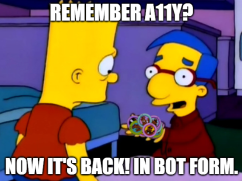

This draft exists to prove one thing. Steward reads a post from the author's checkout and builds it in a worktree that has never seen the post. Anything the post needs from outside its own file has to travel with it.

## What travels

Three kinds of file, plus the markdown:

| Group | Where it lives |
|---|---|
| The post | `src/content/writing/` |
| Its own images | `src/assets/writing/<slug>/` |
| Files it names by root path | `public/` |

The shared dictionary rides along too, when a review has added a word to it.

## The hero and the body image

The hero above is declared in frontmatter. This one sits in the body:

Both resolve to the same folder, and the build fails on either one if the worktree does not have it.

## The video block

A video block names two files under `public/`, and nothing else in the post mentions them:

<Video src="/video/steward-payload-fixture.mp4" poster="/video/steward-payload-fixture-poster.jpg" width={1574} height={820} />

Astro never checks those paths, so a missing one builds cleanly and shows as a broken player. That is why they have to be resolved and copied rather than trusted.
